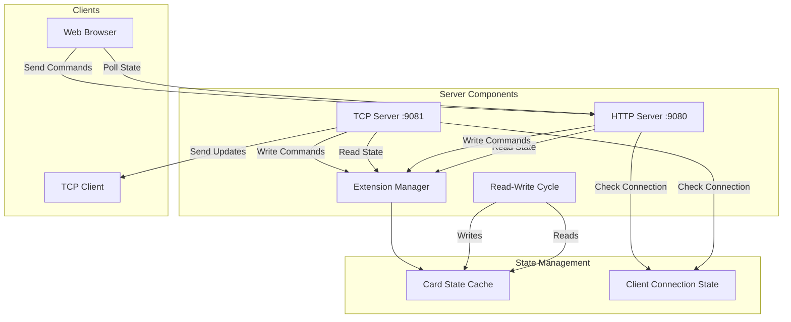

# TCP Server for Extension Cards

## Overview

Implement a TCP server on port 9081 that provides real-time card state updates to automation clients, with automatic frontend control disabling when a TCP client is connected.

## Architecture



## Implementation Details

### 1. TCP Server Module (`src/server/tcp/tcp_server.go`)

**New file** to implement:

- TCP listener on port 9081, **bound to localhost/127.0.0.1 only** (security: reject remote connections)

- Single client connection management (reject additional connections)

- **Connection validation: verify client IP is localhost/127.0.0.1 before accepting**

- JSON message protocol

- Server identification via welcome message sent immediately on connection

- Periodic updates (500ms interval) for all card data

- Immediate updates on value changes (DI, AI fields) via callback from extension manager

- Write command handling from TCP client

**Key components:**

- `TCPServer` struct with connection state tracking

- `ClientConnection` struct to manage connected client

- Message types: `CardStateUpdate`, `WriteCommand`, `WriteResponse`, `WelcomeMessage`

- Change detection for DI and AI fields

- Integration with `extension.Manager` via state change callback

- **IP address validation for localhost-only access**

- `onStateChange()` callback method for immediate updates on DI/AI changes

- `sendWelcomeMessage()` method to identify server to clients on connection

- `sendWelcomeMessage()` method to identify server to clients on connection

### 2. Connection State Management

**Modify** `main.go`:

- Add TCP server instance to `App` struct
- Initialize TCP server in `NewApp()`

- Add connection state check to HTTP write handlers

- **Modify existing `/api/extension/cards` endpoint** to include TCP connection status in response

### 3. HTTP Handler Updates

**Modify** `main.go` handlers:

- `extensionCardHandler` (write-do, write-ao, write-aotype, reboot) - Check TCP connection before processing

- Return `503 Service Unavailable` with message if TCP client connected

### 4. Frontend Updates

**Modify** `src/web/templates/extension.html`:

- Read `tcpConnected` field from existing `/api/extension/cards` response (already being polled)

- Disable all control buttons/inputs when `tcpConnected` is `true`

- Show visual indicator (e.g., banner or icon) when TCP client is active
- Cards endpoint still works (read-only, with delay as mentioned)

### 5. Change Detection

**Modify** `src/server/extension/manager.go`:

- Add `StateChangeCallback` type and callback registration mechanism

- Track previous state before reading each card in `ReadAllAndProcessWrites()`

- Compare DI and AI arrays for changes immediately after modbus read

- Call registered callback immediately when DI or AI changes are detected (no polling delay)

**Implementation:** Change detection happens synchronously in the modbus read cycle, providing immediate notifications to TCP server when values change.

### 6. Write Command Processing

**TCP Server** must:

- Accept JSON write commands in same format as HTTP API:

- `{"type": "write-do", "cardId": "1", "index": 0, "state": true}`

- `{"type": "write-ao", "cardId": "1", "index": 0, "value": 4000.0}`

- `{"type": "write-aotype", "cardId": "1", "index": 0, "mode": "voltage"}`

- `{"type": "reboot", "cardId": "1"}`

- Only queue writes when value actually changes (compare with current state)

- Reboot and AO type change only sent if required (check current state)

- Send periodic writes from client even if unchanged (but server filters duplicates)

### 7. Message Protocol

**Server to Client - Welcome Message (sent immediately on connection):**

```json
{
  "type": "welcome",
  "server": "ControlMate Extension Cards Server",
  "version": "1.0.0",
  "protocol": "JSON",
  "description": "Extension cards automation server - sends card state updates and accepts write commands"
}
```

**Server to Client - Card Update (TCP - JSON):**

```json
{
  "type": "card-update",
  "cards": [
    {
      "id": "1",
      "module": "USR-IO0404",
      "last": {
        "timestamp": "2024-01-01T12:00:00Z",
        "di": [true, false, true, false],
        "do": [false, true, false, true],
        "ai": [1.5, 2.3, 3.1, 4.0],
        "ao": [4000.0, 5000.0, 6000.0, 7000.0],
        "aoType": ["voltage", "current", "voltage", "current"],
        "serialNumber": "SN123456",
        "error": ""
      }
    }
  ]
}
```

**HTTP Cards Endpoint Response (modified):**

```json
{
  "cards": [
    {
      "id": "1",
      "module": "USR-IO0404",
      "last": {
        "timestamp": "2024-01-01T12:00:00Z",
        "di": [true, false, true, false],
        "do": [false, true, false, true],
        "ai": [1.5, 2.3, 3.1, 4.0],
        "ao": [4000.0, 5000.0, 6000.0, 7000.0],
        "aoType": ["voltage", "current", "voltage", "current"],
        "serialNumber": "SN123456",
        "error": ""
      }
    }
  ],
  "tcpConnected": false
}
```

**Client to Server (JSON):**

```json
{
  "type": "write-do",
  "cardId": "1",
  "index": 0,
  "state": true
}
```

**Server Response:**

```json
{
  "type": "write-response",
  "status": "ok",
  "message": "Write queued"
}
```

## File Changes

### New Files

- `src/server/tcp/tcp_server.go` - TCP server implementation

- `src/server/tcp/tcp_server_test.go` - Unit tests

### Modified Files

- `main.go` - Add TCP server, connection state checks, modify cards endpoint response

- `src/server/extension/manager.go` - Added state change callback mechanism for immediate DI/AI change detection

- `src/web/templates/extension.html` - Add TCP status polling and UI disabling

- `src/web/static/app.js` - Add TCP status handling (if needed)

## Implementation Order

1. Create TCP server module with basic connection handling **and localhost-only binding**

2. Implement message protocol (JSON serialization/deserialization)

3. Add welcome message for server identification on connection

4. Add periodic update mechanism (500ms)

5. Implement change detection for DI/AI in extension manager with callback mechanism

6. Register TCP server callback in extension manager for immediate updates

7. Add write command handling with change filtering

8. Integrate with HTTP handlers (connection state checks)

9. Add frontend TCP status polling and UI disabling
10. Testing and refinement (including localhost restriction validation and server identification)

## Testing Considerations

- Test single client connection (reject second client)

- **Test localhost-only restriction (reject connections from non-localhost IPs)**

- Test welcome message sent immediately on connection (server identification)

- Test periodic updates (500ms interval)

- Test immediate updates on DI/AI changes (triggered immediately after modbus read, not via polling)

- Test write command filtering (only write when changed)

- Test frontend disabling when TCP connected

- Test HTTP write handlers rejecting when TCP connected

